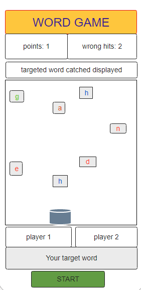

# word-game

<!-- core concept -->
>## About
### This project is all about finding a word by collecting a single letter on given condition.Furthermore, mental excercise and concentration  are core concept of this game.

> ## Used languages and libraries
  * HTML
  * CSS
  * JAVASCRIPT
  * JQUERY 

<!-- project Wiregrames -->
>## Word-game wireframe

<!-- visual representation-->
>## Visual Representation 

<!-- User story  and game logic -->

>## User stories and Game logic

 ### 1. User stories

 1. Both players decide which word will be the target word.

 2. Who will go first.

 3. When the user inputs a word ,hits start button , game should start.

 4. Points and wrong hits should be displayed on the board.

 5. A word that has been selected from player is going to be categorized into 3 section.For example: - player picks a word "good"

  * the targeted letter is "g,o,o,d"  which will be in green color.
  * next sibling letter "h,p,p,e" which will be in blue color.
  * rest of the letter will be in red color.
 
 6. Player has to collect and reached the certain numbers of the next sibling letters to call the targeted word's letter. 

 7. When the letter of the targeted word is collected should be displayed on the targeted word catched board. 

 8. When player collects all of the targeted letters, game will be over for the first player and his/her total points displayed. 

 9. Now, it's turn for second player. 

 10. Who has more points will be the winner.
 

### 2. Game logic

  1. when player inputs a word (for example: "good") and starts a game ,random letters appeared to be falling down besides the targeted letters.
  

  2. Player must collect the next sibling letter to 
  call the targeted letter.For instance:

   * "g,o,o,d" - target letters
   * "h,p,p,e" - next sibling letters
   *  rest of the all letters are non-related letters
   * targeted letters will be appeared in consecutive order,but to call first targeted letter,player has to collect first next sibling letter.For example:

      *  to get "g" , player has to collect one "h" for the first time. 
      *  to get "o", player has to collect two "p" for the second time 
      * to get "o" ,player has to collect three "p" for the third time.
      * to get "d" , player has to collect four "e" 
        for the last time.

3. when player collect points;
      * one next sibling letter gets 1 point
      * one targeted letter gets 1 point
      * to keep in mind, if player collects more than required next sibling,the points for the extra next sibling letter will not be added to  the total points. 
 

4. When player collects non-related letters, points will be deducted as well as wrong hit will increase by 1. For example:

* when game starts; points = 0 , wrong hits = 0 ,if the player collects his/her very first letter is non-releted letter , then game will be over(points = -1)

* if player collects non-related letter ;

    * before "g"(in this context),will loose 1 point as well as wrong hit will increase by 1. (point = n - 1, wrong hits = n + 1 ) where n = any number(1,2,3,4, ....)

   * before "o"(in this context),will loose 2 point as well as wrong hit will increase by 1. (point = n - 2, wrong hits = n + 1 ) 

   * before "o"(in this context),will loose 3 point as well as wrong hit will increase by 1. (point = n - 3, wrong hits = n + 1 ) 
   
   * before "d"(in this context),will loose 4 point as well as wrong hit will increase by 1. (point = n - 4, wrong hits = n + 1 ) 

5. game over condition and winner decision for each player;

    * When point gets less than Zero(0), game is over and total points = - n 

    * When wrong hits is equal to 50% of total length of targeted  word( in this context: 2 is 50% of 4 letters(good)but if length of a word is odd , number will be rounded down), game will be over and total points is (+-)n.

    * who has more total points will be the winner. 

